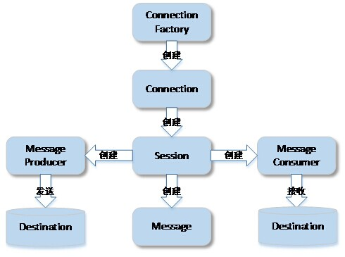

# 传统API接口

传统API提供的主要接口如下：
* ConnectionFactory：客户端用来创建连接的受管对象。简化API也会使用此接口。
* Connection：客户端到JMS提供者之间的活动连接。
* Session：发送和接收消息的一个单线程上下文。
* MessageProducer：由Session创建的对象，用于发送消息到Queue或Topic
* MessageConsumer：由Session创建的对象，用于接收Queue或Topic中的消息

图2-2 传统API概述

